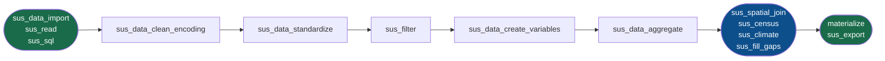

# Ordem canônica do pipeline

O `climasus4py` define uma ordem canônica única. Cada função valida que a
entrada seja um `DuckDBPyRelation` e que as etapas anteriores obrigatórias
tenham sido executadas. Se a ordem for violada, uma mensagem de erro indica
exatamente onde você está e o que deveria ter sido chamado antes.

## Diagrama



## Etapas e o que fazem

### Portas de entrada

| Função | Propósito |
|---|---|
| `sus_data_import(system, uf, year)` | Baixa do FTP DATASUS, cacheia, retorna lazy |
| `sus_data_read(path)` | Abre Parquet/GeoParquet local como lazy |
| `sus_sql(query)` | SQL DuckDB arbitrário como ponto de entrada |

### Pipeline core

| Etapa | Função | O que faz |
|---|---|---|
| 1 | `sus_data_clean_encoding(rel)` | Remove colunas desnecessárias, normaliza encoding |
| 2 | `sus_data_standardize(rel, system)` | Renomeia colunas para nomes canônicos do sistema (SIM-DO, SINASC…) |
| 3 | `sus_filter(rel, ...)` | Filtra por CID-10, idade, sexo, raça, UF, município, data |
| 4 | `sus_data_create_variables(rel, ...)` | Deriva variáveis: faixa etária, semana epidemiológica, estação do ano |
| 5 | `sus_data_aggregate(rel, ...)` | Agrega por tempo (dia/semana/mês/ano) e geografia (município/estado) |

### Enriquecimentos (opcionais, após aggregate)

| Função | Adiciona |
|---|---|
| `sus_spatial_join(rel)` | `geometry_wkt` + nome geográfico |
| `sus_census(rel, year)` | Indicadores IBGE (população, renda, Gini…) |
| `sus_climate(rel, years)` | Variáveis INMET (temperatura, precipitação…) |
| `sus_fill_gaps(rel, method)` | Interpolação de lacunas em séries temporais |

### Saídas

| Função | Destino | Quando usar |
|---|---|---|
| `materialize(rel, how=...)` | RAM | Análise interativa, integração com pandas/polars |
| `sus_export(rel, path)` | Disco | Bases grandes, ETL, sem coletar em memória |

## Enforcement de ordem

Cada função core registra o estágio em que a relação se encontra. Se você
tentasse chamar `sus_data_aggregate` antes de `sus_data_standardize`, receberia:

```
ValueError: sus_data_aggregate esperava uma relação no estágio 'standardize' ou posterior,
mas recebeu 'raw'. Certifique-se de chamar sus_data_clean_encoding → sus_data_standardize antes.
```

## Etapas opcionais

Nenhuma etapa do core é obrigatória quando você já tem um Parquet processado.
Com `sus_data_read()` ou `sus_sql()`, você pode entrar diretamente nos
enriquecimentos — desde que os dados já tenham as colunas esperadas:

```python
# Parquet já limpo e padronizado
rel = cs.sus_data_read("dados/sim_sp_2023_agregado.parquet")
rel = cs.sus_climate(rel, variables=["temp_mean"], years=[2023])
df  = cs.materialize(rel)
```

## Múltiplas entradas

Para combinar dados de múltiplos sistemas, use `sus_sql` como cola:

```python
sim = cs.sus_data_import("SIM-DO", "SP", 2023)
sinasc = cs.sus_data_import("SINASC", "SP", 2023)

# Combinar via SQL após aggregate
sim_agg = cs.sus_data_aggregate(cs.sus_data_standardize(cs.sus_data_clean_encoding(sim), "SIM-DO"), time="month", geo="municipality")
sinasc_agg = cs.sus_data_aggregate(cs.sus_data_standardize(cs.sus_data_clean_encoding(sinasc), "SINASC"), time="month", geo="municipality")

combined = cs.sus_sql("""
    SELECT s.*, n.nascimentos
    FROM sim_agg s
    LEFT JOIN sinasc_agg n USING (municipality_code, month)
""")
```
